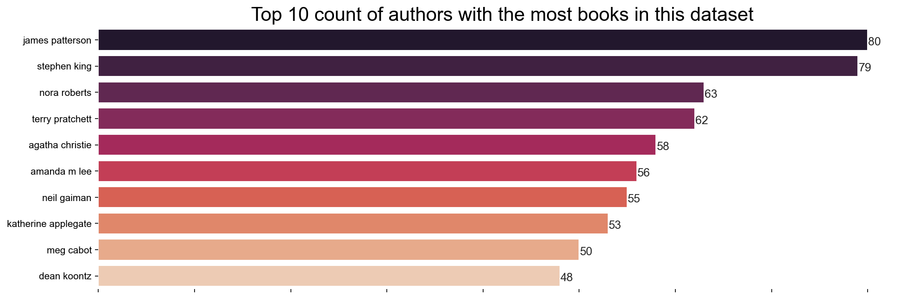
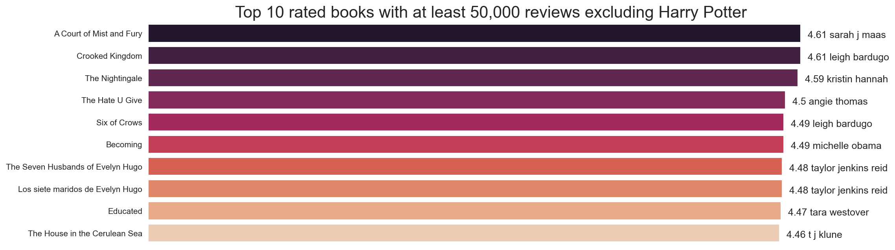
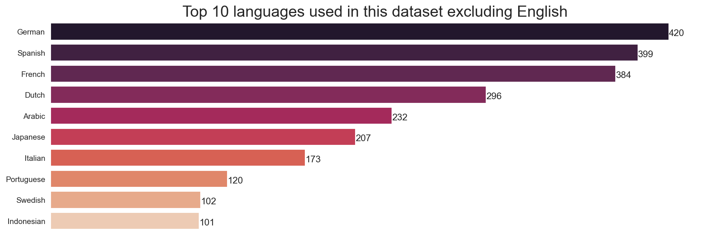

# Book Recommender System
A cold start problem. How do we recommend books without past user’s preference or information?

### TOC

- Part 1: Data Data Collection
- Part 2: Data Exploration
- Part 3: Creating Recommendation System

### Part 1: Data Collection

Step 1: Used the scrapy spider created by [havanagrawal](https://github.com/havanagrawal/GoodreadsScraper) to scrape Goodreads.
Total Books scraped: 175,406 from 28 lists of books.

|#|List Scrapped|
|---|:---|
|1|Best_Page_Turners_with_Redeeming_Social_Value|
|2|Couldn_t_Put_The_Book_Down_|
|3|Books_you_wish_more_people_knew_about_Part_II|
|4|Best_Books_of_the_21st_Century|
|5|Books_that_Blew_Me_Away_and_that_I_Still_Think_About_of_all_types_|
|6|Best_Unknown_but_must_be_Known_books_|
|7|1001_Books_You_Must_Read_Before_You_Die|
|8|Books_That_Everyone_Should_Read_At_Least_Once|
|9|Lesser_Known_Authors|
|10|What_To_Read_Next|
|11|The_Most_Influential_Books|
|12|100_Books_to_Read_in_a_Lifetime_Readers_Picks|
|13|Books_That_Should_Be_Made_Into_Movies|
|14|Must_Read_Non_Fiction|
|15|I_m_glad_someone_made_me_read_this_book|
|16|Best_Books_Ever|
|17|Books_With_a_Goodreads_Average_Rating_of_4_5_and_above_and_With_At_Least_100_Ratings|
|18|Books_that_Changed_the_Way_You_View_Life|
|19|100_Mysteries_and_Thrillers_to_Read_in_a_Lifetime_Readers_Picks|
|20|Read_Them_Twice_At_Least|
|21|Books_You_Wish_More_People_Knew_About|
|22|Best_Young_Adult_Books|
|23|Interesting_and_Readable_Nonfiction|
|24|Best_Books_of_the_18th_Century|
|25|Best_Books_of_the_Decade_2000s|
|26|Best_for_Book_Clubs|
|27|Best_Science_Fiction_Fantasy_Books|
|28|Best_Books_of_the_Decade_1990s|

Step 2: Scrapped Wikipedia
To fill in the null values, I used wptools to scrape Wikipedia's info-boxes

Step 3: Identify book's written language by the title
Using the library: LangID and then matching to the ISO language code table, I map out the null values for the language column

### Part 2: Data Exploration
Some sample exploration done. Please look at the code: Part2_EDA.ipynb for more.

### Part 3: Creating Recommender System
Method 1: Using MinMaxScaler to normalise the features, I then fitted a Ball Tree Algorithm first with different features such as average rating, languages, number of reviews, and number of pages. Ran the model but the recommendations given did not seem too relevant. Subsequently, I used it on a single feature genre and that result in better recommendations.

Method 2: Using SentenceTransformer on the Genres column, I then calculated the cosine similarity, generating a recommender system base on the closest cosine similarity. This result is very similar to method 1 when I use on the genres column.

Finally to get the best of all three, I combine the recommendations into a single dataframe.

### Conclusion
I've created 3 recommender systems to recommend books in a cold start scenario using content base filtering. And then combining them together to get a unique list of books that is similar by way of distance calculated using cosine similarity and a ball tree classifier. It would seem that the best feature to use would be the genre column in this case.

There is another way, using the multi-armed bandit method, where random books are recommended to the user to get the user feedback. And if the user rates a book positively, the recommender would then generate a new list of recommendations. However, due to time constraint, I shall not be exploring this method.

One recurring issue I constantly face was the lack of memory/ram to run and test different models and ideas. This restricted my ability to run more test and visualise some graphs. One way to work around this would be to work in a cloud environment. But once again due to time constraint and financial reasons I did not take that step. But it would be a good way to further enhance the recommender system.
