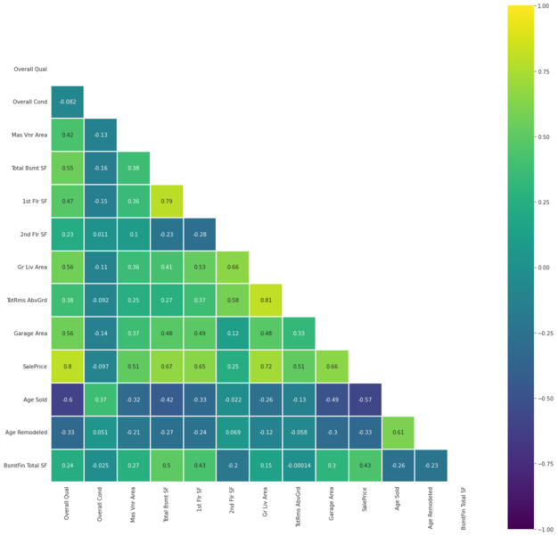
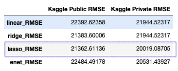

## Table of Content

1. [Background](#Background)
2. [Dataset](#Dataset)
3. [Data Wrangling](#Data_Wrangling)
4. [EDA](#EDA)
5. [Model Preprocessing](#Model_Preprocessing)
6. [Machine Learning](#Machine_Learning)
7. [Kaggle Submission](#Kaggle_Submission)
8. [Conclusion](#Conclusion)
9. [Recommendations](#Recommendations)

## Background
Purpose of this project is to create regression models based on the Ames Housing Dataset. This model will be used to predict the price of a house on sales.

The Ames Housing Dataset is an exceptionally detailed and robust dataset with over 70 columns of different features relating to houses.

The results of testing the model will be submitted to [Kaggle](https://www.kaggle.com/c/dsi-us-11-project-2-regression-challenge)

The rough focus would be to create a program for a real estate agents to better estimate the selling price of a house they would like to market

First I'll be prepping the dataset by doing feature engineering, dropping some variables and doing general cleaning.
I'll then do some simple exploratory data analysis on the cleaned data and finally fit the data into different regression models to try and predict as close as possible the actual sale price of past tranacted properties.
## Dataset
The Ames Housing Dataset for this project is split into two. One would be used to train the model and the other to test how well the model does.

They can be found [here](https://www.kaggle.com/c/dsi-us-11-project-2-regression-challenge/data).

The description of the dataset can be found [here](http://jse.amstat.org/v19n3/decock/DataDocumentation.txt)
## Data_Wrangling
### For Catergorical Data
1. Variables to drop: (Total:14)
|Variables| Reason for dropping|
|---|---|
Fence|not much difference in price range|
Misc Feature| not much difference in price range|
Garage Qual| Very similar to Garage Cond|
Heating| data captured in Heating QC|
Bsmt Exposure| info reflected in Bsmt Cond and Qual|
BsmtFin Type 1| info reflected in Bsmt Cond and Qual|
BsmtFin Type 2| info reflected in Bsmt Cond and Qual|
Roof Style| the different types are within the same interquartile price range|
Land Slope| there isn't much difference in the price range|
Lot Config| there isn't much difference in the price range|
Utilities| Mostly all in one category|
Street| Info captured under Alley|
Exterior 1st and 2nd| Info capture in exterior cond and quality|

2. Feature Engineering (Total:13)
|Variable|attributes|
|---|---|
Garage Cond| TA, Gd, Ex to a the rest to b|
Garage Type| Attchd, Bulitin, 2Types to a the rest to b|
Fireplace Qu| Ex as a, Gd, Fa and Gd as b, the rest as c|
Functional| Sev, Sal, Maj2 as b the rest as a|
Electrical| SBrkr as a the rest as b|
Heating QC| Ex as a, Ta,Gd, Fa as b, Po as c|
Bsmt Cond| Ex, Ta, Gd as a, the rest as b|
Bsmt Qual|Ex as 2, Gd a, the rest as b|
Foundation| PConc, Wood, and the rest as others|
Exter Cond| Ex as a, Po as c and the rest as b|
Exter Qual| Ex as a, Gd, as b, the rest as c|
Roof Matl| WdShngl and WdShake as wood and the rest as others|
Condition 2| PosA and PosN as a and the rest as b|

### For Numerical Data (And some categorical data then came under here due to dtypes)
1. Variables to Drop
|Variable| Reason for dropping|
|---|---|
Id| make this as the Index
PID|This is to identify the specific property and it is not of use here
Lot Frontage|no clear pattern discernable
Lot Area| the same as Lot Frontage
Bsmt Unf SF| No clear pattern and it is not logical that the size of an unfinish basement would affect the sales price
Low Qual Fin SF| No clear pattern that can be established
Bsmt Half Bath| No clear pattern that can be established
Half Bath| No clear pattern that can be established
Bedroom AbvGr| No clear interpretation can be made. ex: 0 bedrooms does better then 6?
Kitchen AbvGr| Most are graded 1 with 2 and above not making any impact
Garage Yr Blt| There's an outlier at year 2200 and it does not make sense to price a house on the garage's age
Wood Deck SF| No clear pattern that can be established
Pool Area| this information should be captured in Pool QC
Misc Val| Established earlier with Misc Feature not contributing to the sales price range
Mo Sold| This is not going to help our consumer decide on how to price a house
Garage Cars| Captured in Garage Area

2. To Feature Engineer
* MS SubClass: 120 and 60 as 'a', 20 and 75 as 'b' the rest as 'c'
* Combine: Open Porch SF, Enclosed Porch, 3Ssn Porch and Screen Porch into one catergorical variable call Porch
* Combine: Year Sold and Year Built to get Age of the house when sold
* Combine: Year Remod/Add, Year Built, and Year Sold to see if remodeling affects
* Combine: BsmtFin SF 1 and 2 together as Total BsmtFin SF
* Bsmt Full Bath: 0 as 'NA', 1 as 'One', 2 and above as 'Multi'
* Full Bath: 0-1 as '0-1', 2 as '2', and 3 or more as '>2'
* Fireplace: 0 as 'NA', 1-2 as '1-2' and 3 or more as '>2'

3. Variables that are numeric but falls under categorical (To One Hot Encode):
|Variable|Comments|
|---|---|
|TotRms AbvGrd| Rooms with above avg grade|

4. Some General comments

Interesting that once rooms above average grade hits 10 the salesprice starts to taper off and actually drop when it hits 12.Same goes for garage cars, where the curve drops after 3 cars.

This seems to indicate, that unlike Singapore a larger property might not command a higher selling price in Ames. This could be reflection of the space constraint we have here.

_Note the decision to keep, drop or merge the variables are based on a mix of logic, looking at the boxplot and researching online/ descriptive abstract of the different terms. Also not documented are the many smaller plots and comparison made between variables but cleaned up to make the code more concise for readability._

## EDA
I generated a pairplot to take a look at other possible relationships

Interesting that garage area and total basement square feet is in the top 5 correlation to sales price of a property in the US.

I also generated a heatmap to look at the possible correlation between the variables:

## Model_Preprocessing
The steps taken here, are in summary:

1. One hot encode all Nominal Variables using pd.get_dummies
2. Separate out the Ordinal variables to maintain the attributes as is
3. Use polynomial features on the numerical columns to create interaction and reduce bias.
4. Standardise the numerical columns with a mean of 0 and std dev of 1.
5. Finally split the dataset into training and testing set to fit into the models later.

After processing my dataset to fit into the model had 2049 rows and 164 columns

## Machine_Learning
I'll be training the data using 4 different types of models to try and predict the sale price of a property:

* Linear Regression - This would be considered my baseline model, using a regression line to try and predict prices
* Ridge - As the data suffer from multicollinearity, I expect the ridge model to work better
* Lasso - Using Lasso which tend to make coefficients to absolute zero I hope to get a model with better feature selection.
* ElasticNet - Finally with Elastic Net, which is a combination of both L1 regularisation and L2 regularisation I want to see if both shrinking the coefficients as well as eliminating some of the insignificant ones would result in a more accurate model.

Belows are the results:

## Kaggle_Submission

## Conclusion
Plotting the qq-plot (Quantile-Quantile Plot) we can see that all 4 models behaved very similarly with the major difference being how far out the outliers were from the actual sales price of the property. It can be say to say that all 4 models would be able to predict with high accuracy the price of the property in Ames if the price range is between 100k to 400k.

With the P value between 0.95 and 0.98 we can accept the null hypothesis that there is no difference in the predictions versus the actual prices except for chance.

Overall using any of the 4 models, a real estate agent would be able to price the houses in Ames with very high accuracy if it is between a 100k-400k. Any lower or higher and the model might be extremely inaccurate.

## Recommendations
For improving on the ML models:

1. Find a better way to deal with Outliers. I have not found a good way to deal with outliers. Any outliers dropped (other then the 2 at the start) resulted in the models leaning towards a greater overfit.
2. Drop or feature engineer more variables especially those that have very high multicollinearity
3. Have a better way to combine certain categories to lessen the amount of 'noise'
4. Other factors could perhaps be taken into account also like the crime rate and socio-economic status of the neighbourhood
5. Further Data exploration and cleaning could have been done but was ignored due to time constraint, like for example having full bathroom listed as multi but basement area as 0.
6. One of the issues could be that, there are not enough low transacted properties and extremely expensive properties data to feed into the model. Perhaps if more data was available for properties priced at the extreme ends, the model would be able to return better results overall.

For client or real estate agent looking to use the model to estimate sale price:

1. Less is more, too many measurements of same information would cause the predictions to go way off for unseen data. example having the count of the number cars able to fit into the garage and the total garage space is not only redundant but also hurts the accuracy of the models. (Although that information could be used for marketing purposes)
2. Certain data could could be combined together. Example the type of porch rather then they being tracked separately.
3. The ability to record the 'right' attributes into the model is key to a better price estimate.
