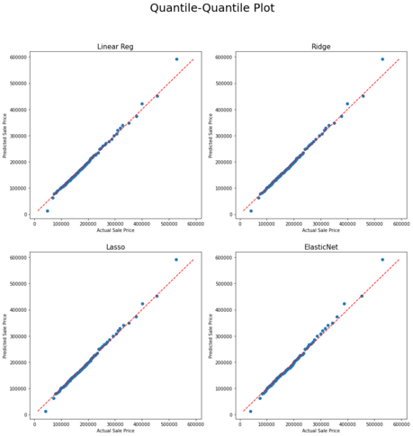

Work in progress :man_mechanic:

## Table of Content

1. [Background](#Background)
2. [Dataset](#Dataset)
3. [Data Wrangling](#Data_Wrangling)
4. [EDA](#EDA)
5. [Model Preprocessing](#Model_Preprocessing)
6. [Machine Learning](#Machine_Learning)
7. [Kaggle Submission](#Kaggle_Submission)
8. [Conclusion](#Conclusion)
9. [Recommendations](#Recommendations)

## Background
## Dataset
## Data_Wrangling
## EDA

## Model_Preprocessing
The steps taken here, are in summary:

1. One hot encode all Nominal Variables using pd.get_dummies
2. Separate out the Ordinal variables to maintain the attributes as is
3. Use polynomial features on the numerical columns to create interaction and reduce bias.
4. Standardise the numerical columns with a mean of 0 and std dev of 1.
5. Finally split the dataset into training and testing set to fit into the models later.

After processing my dataset to fit into the model had 2049 rows and 164 columns

## Machine_Learning
I'll be training the data using 4 different types of models to try and predict the sale price of a property:

* Linear Regression - This would be considered my baseline model, using a regression line to try and predict prices
* Ridge - As the data suffer from multicollinearity, I expect the ridge model to work better
* Lasso - Using Lasso which tend to make coefficients to absolute zero I hope to get a model with better feature selection.
* ElasticNet - Finally with Elastic Net, which is a combination of both L1 regularisation and L2 regularisation I want to see if both shrinking the coefficients as well as eliminating some of the insignificant ones would result in a more accurate model.

Belows are the results:

## Kaggle_Submission

## Conclusion
Plotting the qq-plot (Quantile-Quantile Plot) we can see that all 4 models behaved very similarly with the major difference being how far out the outliers were from the actual sales price of the property. It can be say to say that all 4 models would be able to predict with high accuracy the price of the property in Ames if the price range is between 100k to 400k.

With the P value between 0.95 and 0.98 we can accept the null hypothesis that there is no difference in the predictions versus the actual prices except for chance.

Overall using any of the 4 models, a real estate agent would be able to price the houses in Ames with very high accuracy if it is between a 100k-400k. Any lower or higher and the model might be extremely inaccurate.

## Recommendations
For improving on the ML models:

1. Find a better way to deal with Outliers. I have not found a good way to deal with outliers. Any outliers dropped (other then the 2 at the start) resulted in the models leaning towards a greater overfit.
2. Drop or feature engineer more variables especially those that have very high multicollinearity
3. Have a better way to combine certain categories to lessen the amount of 'noise'
4. Other factors could perhaps be taken into account also like the crime rate and socio-economic status of the neighbourhood
5. Further Data exploration and cleaning could have been done but was ignored due to time constraint, like for example having full bathroom listed as multi but basement area as 0.
6. One of the issues could be that, there are not enough low transacted properties and extremely expensive properties data to feed into the model. Perhaps if more data was available for properties priced at the extreme ends, the model would be able to return better results overall.

For client or real estate agent looking to use the model to estimate sale price:

1. Less is more, too many measurements of same information would cause the predictions to go way off for unseen data. example having the count of the number cars able to fit into the garage and the total garage space is not only redundant but also hurts the accuracy of the models. (Although that information could be used for marketing purposes)
2. Certain data could could be combined together. Example the type of porch rather then they being tracked separately.
3. The ability to record the 'right' attributes into the model is key to a better price estimate.
