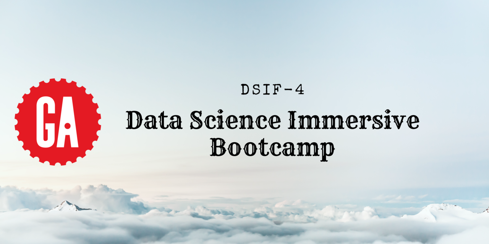

This repository contains all the projects done for General Assembly's [Data Science Immersive Bootcamp](https://generalassemb.ly/education/data-science-immersive/singapore) between Nov 2021 to Jun 2022.

1. [Project 1: SAT Test Analysis and Visualisation](./Project_1)
2. [Project 2: Regression Modeling using Ames Housing Data](./Project_2)
