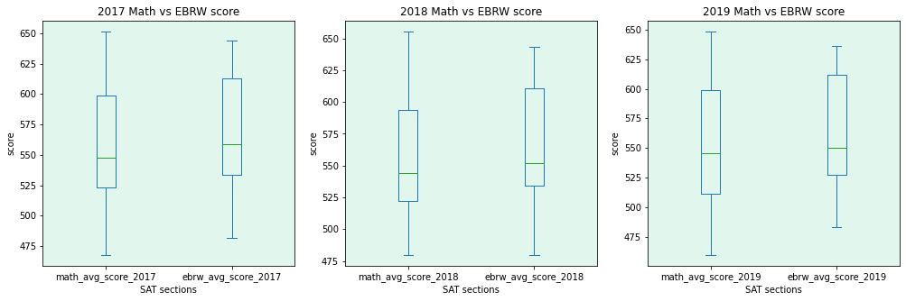

# Table of Contents
* [Background](#Background)
* [Functions](#functions-created)
* [Exploratory Data Analysis](#exploratory-data-analysis)
* [Data Visualization](#Data-Visualization)
* [Conclusion](#Conclusion)
* [License](#License)

# Background

This is the first project I am doing at General Assembly's Data Science Immersive Bootcamp.

I'll be taking a look at the aggregate SAT scores and participation rates in the United States between 2018 - 2019. Seek to identify trends in the data and combine data analysis with outside research to address a problem statement.

The **problem statement** I decided to go with was:

More and more schools in the USA are changing their math curriculum, lowering the standards required to make it easier for those struggling with math. Is the trend of students taking the SAT test showing a worsening performance towards math and a greater lean towards reading and writing? This short analysis would take a look at the math score, across the states and see if we can find any noticeable trends or patterns.

I had to create some simple functions to be used later, uploaded, clean and merged some datasets. Did an analysis on the data and visualised some of them.

### Description of the Dataset used

The datasets I used were from [PrepScholar](https://www.prepscholar.com/sat/s/) They consist of five columns: the states, average math score, average EBRW score, average total score and the participation rates.

- 2017 SAT Scores by State [Download](./data/sat_2017.csv) ([source](https://blog.collegevine.com/here-are-the-average-sat-scores-by-state/))
- 2018 SAT Scores by State [Download](./data/sat_2018.csv) ([source](https://blog.collegevine.com/here-are-the-average-sat-scores-by-state/))
- 2019 SAT Scores by State [Download](./data/sat_2019.csv) ([source](https://blog.prepscholar.com/average-sat-scores-by-state-most-recent))

The description of the merged and cleaned up dataset used:
|Feature|Type|Dataset(year)|Description|
|---|---|---|---|
participation_rate_2017|float64|2017| The participation rate of students for the different states in 2017
ebrw_avg_score_2017|int64|2017|Average score for Evidence-Based Reading and Writing (critical reading and writing makes up 2/3 of the score)
math_avg_score_2017|int64|2017| Average score for the 2017 math section of the SAT test across the state
total_avg_score_2017|int64|2017| The sum of both the Math score and the EBRW score for 2017. The minimum is 400 and the max 1,600.
participation_rate_2018|float64|2018| The participation rate of students for the different states in 2018
ebrw_avg_score_2018|int64|2018|Average score for Evidence-Based Reading and Writing (critical reading and writing makes up 2/3 of the score)
math_avg_score_2018|int64|2018| Average score for the 2018 math section of the SAT test across the state
total_avg_score_2018|int64|2018| The sum of both the Math score and the EBRW score for 2018. The minimum is 400 and the max 1,600.
participation_rate_2019|float64|2019| The participation rate of students for the different states in 2019
ebrw_avg_score_2019|int64|2019|Average score for Evidence-Based Reading and Writing (critical reading and writing makes up 2/3 of the score)
math_avg_score_2019|int64|2019| Average score for the 2019 math section of the SAT test across the state
total_avg_score_2019|int64|2019| The sum of both the Math score and the EBRW score for 2019. The minimum is 400 and the max 1,600.

# Functions Created

1. Calculating the Mean
```Python
def cal_mean(lst):
  result = 0
  for i in lst:
      result+=i
  return result/len(lst)
```

2. Calculating Standard Deviation using the above mean function
```Python
def standard_deviation(lst):
    mu = cal_mean(lst)
    n = len(lst)
    var = sum((x-mu)**2 for x in lst)/n
    return (var)**0.5
```

3. Converting string format of a percentage value to floats (eg.'30%' to 0.3)
```Python
def percent_string_to_float(string):
  return (float(string.replace('%',''))/100)
```

# Exploratory Data Analysis

#### In my exploration of the dataset, I looked at the participation rates across all three years and these were the general observations:

1. Delaware, Connecticut and Michigan has 100% participation rate across the years
2. Full participation rate has increased over time. From just 4 states in 2017 to 5 in 2018 and 8 in 2019
3. Overall participation rates in the top 10 averaged higher over the three years.
4. There are 3 states that tie at the bottom with the lowest participation rate in 2017. They're: North Dakota, Mississippi, Iowa and Missouri
5. North Dakota has been consistently the state with the lowest participation at only 20%
6. While the participation rates of the top 10 states trend upwards, the bottom states has no significant changes remaining between 20% - 40%

#### I then took a look at the total mean SAT scores across the states and came up with these observations:

1. Minnesota and Wisconsin had the top 2 total composite score for all three years. Their results for 2019 is only different by a single point.
2. The average total scores are consistently range bound between 1298 and 1260 inclusive
3. States in the top 5 across the years are neighbouring states, geographically located at the mid-north of the country. [Original Map](http://alabamamaps.ua.edu/contemporarymaps/usa/basemaps/usstates1.jpg)

4. Delaware, Idaho and District of Columbia consistently rank at the bottom 5
5. 2019 was the worst performing year for the bottom 5 states
6. Geographically there is no observable patterns unlike the top 5

#### Finally I looked at the states with higher then the national average scores for both EBRW and math and came up with these findings:

**For the states that are above the national math average score from 2017 to 2019**

1. 2017 had 25 states above the national average and this has since dropped to 18 in 2018 and 19 in 2019.
2. It is interesting to note that states listed as the least educated states: Alabama, Arkansas, Louisiana, and Mississippi are above the national average. While states that are listed as the most educated are not in the any of the list: Maryland, Connecticut, with Vermont and Colorada making it above the national average only in 2017.[source](https://worldpopulationreview.com/state-rankings/least-educated-states)
3. It is also noteworthy that states with higher participation rate do not appear in any of the above years. Does this takeaway weight from the theory that the environment plays a major factor in a person's ability to get a good education? Or are there outliers in the data that is pulling down the overall average score of these states?

**For EBRW scores that are above the national average findings:**

1. It can be observed that states with above national average score for EBRW continue to do so across all three years with the exception of afew.
2. Compared to the math national average results, the total number of states above the national average for EBRW is just one more then math.
3. It is interesting to see that Colorado also made the list for 2017 but not so for subsequent years. Was there any natural or man-made disaster in Colorado after 2017 that is causing the students to fall behind?

# Data Visualisation

For the visualisation, I created **heatmaps** to look for the correlation between the scores. 

**boxplots** for a better comparison on the range of the both the Math and EBRW scores. 

and finally a **lineplot** to look at the trend of the scores over time. 

# Conclusion

There are a few key takeaways I took away from my analysis.

1. There is a high negative correlaton between participation rates and scores. Could it be that states that mandate students to take the SAT result in unwilling participants that would put down the overall averages?
2. From just these three years, it looks like the results are trending downwards for both math and EBRW
3. There are more factors at play then meets the eye. For example the changing of the math section in 2018 and more recently the dropping of the EBRW essay section in 2021 [source](https://blog.collegeboard.org/January-2021-sat-subject-test-and-essay-faq)
4. An interesting phenomenon that could be looked at would be why are the top scoring states in the mid-north of the country. And what are they doing differently that is helping the students in those states do well overall.

# Credits

Author: [JoelTanSG](https://github.com/JoelTanSG)

Instructors from GA: Divya Venkatraman, Ben Lim and Shao Quan

# License

[MIT](https://github.com/JoelTanSG/GA-Project-1-Standardized-Test-Analysis/blob/main/LICENSE)
